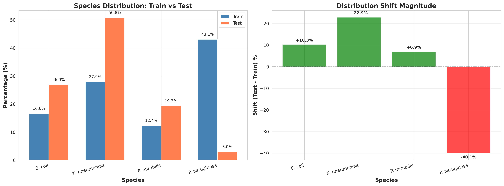
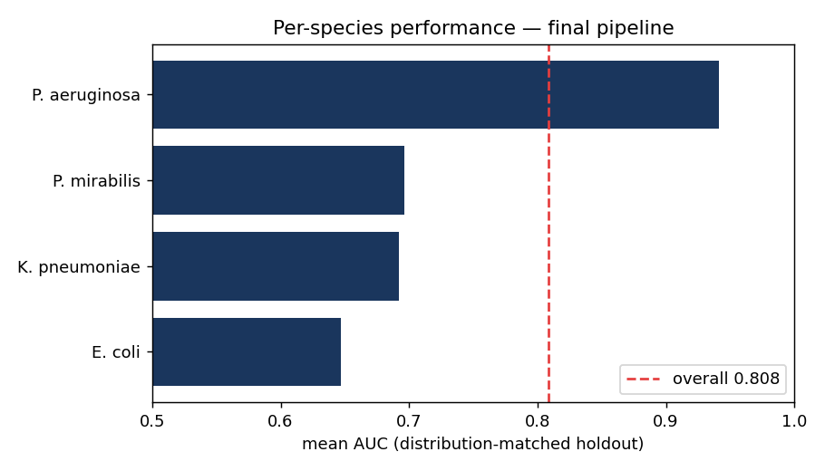

# Predicting Antibiotic Resistance from MALDI-TOF Mass Spectra

Bacterial resistance to 8 antibiotics, predicted from MALDI-TOF mass spectra. The
training and test sets are drawn from nearly inverted species populations —
*P. aeruginosa* is 43% of training but 3% of test, while *K. pneumoniae* is 28% of
training and 51% of test — so the approaches that score best in cross-validation are
not the ones that generalize. This repository documents which survived that shift and
which collapsed.

| Submission | Public LB | Private LB | OOF CV |
|---|---|---|---|
| **Mega-blend (rank average)** | **0.839** | **0.813** | 0.817 |
| Self-training blend | 0.837 | 0.809 | 0.805 |
| LightGBM + PLS | 0.832 | 0.801 | 0.799 |
| Stacking | 0.827 | 0.784 | *0.955* |
| Baseline | 0.802 | 0.786 | 0.782 |

Two rows carry the result. Stacking had the best cross-validation score by ~14 points
(0.955 OOF) and the worst generalization (0.784 private). Rank averaging — which learns
no combination weights — generalized best. Under distribution shift, the robust ensemble
beat the clever one. Metric throughout is mean ROC-AUC across the 8 antibiotics.

## Background

Antimicrobial resistance is a leading cause of death worldwide, and the standard assay
for it — culture-based susceptibility testing — takes days. MALDI-TOF mass spectra are
already acquired routinely to identify bacterial species in minutes. If resistance can
be read from the same spectrum, treatment decisions move days earlier. The question here
is narrow and empirical: how much resistance signal is recoverable from these spectra,
and where is the ceiling?

## Data

| | |
|---|---|
| Input | 6,000 binned MALDI-TOF m/z features (~3 Da/bin); 93.4% zeros |
| Output | binary resistance for 8 antibiotics (multi-label) |
| Samples | 3,360 train · 1,000 test |
| Species | 4 bacterial species, with the train↔test shift above |
| Labels | partially missing (42.8% for Amoxicillin/Clavulanic acid) — semi-supervised |



Every quantitative claim in this README is recomputed from the raw data by
[`scripts/verify_claims.py`](scripts/verify_claims.py).

## Findings

**1. The validation set must match the test distribution, or it misleads.** Standard
k-fold cross-validation draws folds from the training species mixture; the test set is a
different mixture, so out-of-fold AUC ran 6–12 points above the leaderboard. A held-out
set stratified to the test species proportions (2,688 train / 672 validation) was the
prerequisite for every reliable decision that followed.

**2. A per-subgroup proxy metric does not optimize the global objective.** Tuning AUC for
*K. pneumoniae* alone — the hardest species and 51% of the test set — raised its score but
lowered the leaderboard, because the gain came out of *E. coli* and *P. mirabilis*. The
objective is the masked mean AUC across all eight antibiotics; a per-species proxy is not a
substitute for it.

**3. Rank averaging generalized; stacking did not.** Stacking reached 0.955 cross-validation
AUC and 0.784 private — a ~17-point collapse. The meta-learner fit fold-level structure that
the shifted test distribution does not share. Rank averaging combines models without learning
weights, so it has nothing to overfit; it scored 0.813 private from a lower 0.817 OOF. The gap
between the OOF and private columns is the finding.

**4. Biology supplies exact predictions for free.** Two species are intrinsically
(deterministically) resistant to specific drugs: *P. aeruginosa* to five of the eight,
*P. mirabilis* to imipenem. Encoding these rules fixes 4.3% of test prediction cells exactly
(343 of 8,000); 22% of test samples receive at least one label that needs no model.

Full discussion: [`docs/04_results_and_lessons.md`](docs/04_results_and_lessons.md).

## Method

The final pipeline rank-averages three diverse gradient-boosted models (LightGBM, XGBoost,
CatBoost; plus a PLS-reduced LightGBM), reweights predictions toward the test species
distribution, and overrides the intrinsic-resistance cells. Dimensionality reduction is
supervised (PLS), because unsupervised reduction (PCA/KPCA/NMF) discards low-variance peaks
that carry resistance signal. Missing labels are masked in both the loss and the metric.
The validation split, models, and ensembling are documented in
[`docs/03_methodology.md`](docs/03_methodology.md); the from-scratch components
(`MaskedBCEWithLogitsLoss`, `PerSpeciesPLS`, `MultiStageSelector`, a controlled-experiment
harness) live in `src/`.

## Reproduce

```bash
uv sync                                              # Python ≥ 3.11
# place the competition CSVs in raw/  (see data/README.md)

uv run python scripts/verify_claims.py               # recompute every number above from raw data
uv run python scripts/smoke_test.py                  # sanity check
uv run python experiments/reproduce_holdout_eval.py  # per-species / per-antibiotic AUC on the holdout
uv run python experiments/run_mega_blend.py          # the best submission
```

The Kaggle leaderboard is closed, so the public/private LB columns above cannot be re-queried;
`reproduce_holdout_eval.py` instead re-derives the result on the distribution-matched holdout
that we controlled during the competition, and writes [`reports/holdout_eval.json`](reports/).

## What this project demonstrates

| Area | Demonstrated by |
|---|---|
| Validation design under covariate shift | building a deployment-matched holdout; quantifying the OOF→LB gap |
| Ensemble selection | rank-averaging vs. weighted vs. stacking, with the failure analysis for each |
| Semi-supervised learning | self-training / pseudo-labeling; transductive dimensionality reduction |
| Missing-label handling | masked BCE loss + masked AUC for partially-observed multi-label targets |
| Domain integration | encoding microbiological intrinsic-resistance priors as hard constraints |
| Experimental rigor | a controlled-experiment harness; ablations across models, reduction, and ensembling |
| Stack | LightGBM · XGBoost · CatBoost · PyTorch · scikit-learn · PLS/PCA · uv |

## Where the difficulty actually is (reproduced)

Re-deriving the pipeline on the distribution-matched holdout
([`experiments/reproduce_holdout_eval.py`](experiments/reproduce_holdout_eval.py)) gives a
mean AUC of 0.808 — but the per-species breakdown is more informative than the aggregate.



Pooled across species the blend scores ~0.81; *within* the three species that dominate the
test set it scores only 0.65–0.70 (E. coli 0.65, K. pneumoniae 0.69, P. mirabilis 0.70).
Much of the headline number is the model separating *species*, which are themselves
predictive of resistance — not discriminating resistance among isolates of the *same*
species. The genuinely hard problem sits near 0.65–0.70, and that is the real ceiling.
(P. aeruginosa scores 0.94 but on only 21 holdout samples, most of whose labels the
intrinsic rules already fix — a small, easy slice.)

## Limitations and ceiling

The ~0.81 private plateau appears structural. Sample reweighting changes the loss but not the
learned representation, which remains *P. aeruginosa*-dominated from training; it cannot
manufacture *K. pneumoniae* signal that the training data underrepresents. Moving past this
likely requires species-conditioned inference, explicit domain adaptation, or transductive
methods that use test-set features during training — none of which were solved within the
competition window.

## References

1. C. Weis et al. *Direct antimicrobial resistance prediction from clinical MALDI-TOF mass spectra using machine learning.* Nature Medicine 28, 164–174 (2022). [DRIAMS dataset]
2. G. Ke et al. *LightGBM: A Highly Efficient Gradient Boosting Decision Tree.* NeurIPS 2017.
3. T. Chen, C. Guestrin. *XGBoost: A Scalable Tree Boosting System.* KDD 2016.
4. L. Prokhorenkova et al. *CatBoost: unbiased boosting with categorical features.* NeurIPS 2018.

## Authors

Mohammad Erfan Jabbari and Ana-Maria Mirza — Universidad Carlos III de Madrid · IMDEA Networks
Institute. Machine-learning course project, January 2026; built around the Kaggle
[AMR Prediction from MALDI-TOF](https://www.kaggle.com/competitions/antimicrobial-resistance-prediction-from-maldi-tof)
challenge. Licensed under [MIT](LICENSE).
