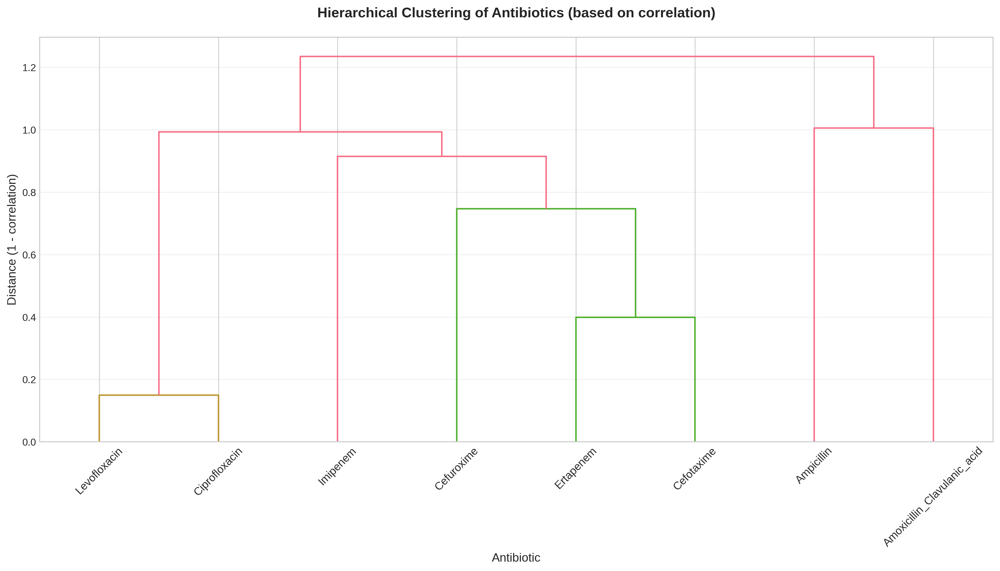

# 02 — EDA Findings

Eight analysis phases (`scripts/eda/phase1..8`); per-phase notes in
[`insights/`](insights/). The findings that actually changed modeling decisions:

## 1. Species distribution shift (the headline)

| Species (id) | Train % | Test % | Implied action |
|---|---|---|---|
| P. aeruginosa (3) | 43.1% | 3.0% | **downweight ~0.05–0.1×** |
| K. pneumoniae (1) | 27.9% | 50.8% | **upweight ~2–3×** |
| E. coli (0) | 16.6% | 26.9% | upweight ~1.5× |
| P. mirabilis (2) | 12.4% | 19.3% | upweight ~1.5× |

The χ² test on the train-vs-test species contingency table is overwhelmingly
significant. This single fact dictates the validation design.

## 2. Intrinsic resistance = exact, free predictions

Two species are biologically guaranteed resistant to specific drugs:

| Species | Always resistant to |
|---|---|
| P. aeruginosa | Ampicillin, Amoxicillin/Clavulanic acid, Ertapenem, Cefotaxime, Cefuroxime |
| P. mirabilis | Imipenem |

In the test set this fixes **~4.3% of all prediction cells** (343 of 8,000:
P. aeruginosa 30 samples × 5 drugs + P. mirabilis 193 samples × 1 drug), i.e. about
**22% of test samples** receive at least one deterministic label.

## 3. Extreme feature sparsity

93.3% of feature values are zero; ~400 of the 6,000 features (6.7%) are constant
(zero-variance) and dropped (`var < 1e-5`). This is why **gradient-boosted trees beat
neural nets** here — native sparse handling, no need for the data density an MLP wants.

## 4. Non-random missing labels

Label missingness correlates with species and drug relevance (e.g. ~96% missing for
Amox/Clav within P. aeruginosa). Handled with masked loss / masked AUC.

## 5. Antibiotic correlations (shared resistance mechanisms)

- Levofloxacin ↔ Ciprofloxacin: r = 0.925 (same fluoroquinolone class)
- Ertapenem ↔ Cefotaxime: r = 0.813
- Imipenem ↔ Ertapenem: r = 0.772 (both carbapenems)

These correlations justify multi-task treatment and explain why diverse base models
still agree on the easy structure.

